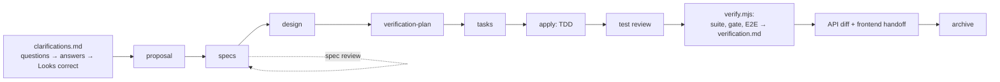

# sdd-kit

Spec-Driven Development for small teams on **OpenSpec + Claude Code**.

Teams that hand vague client requirements straight to an AI agent get code that does what the agent guessed.
That means bugs for manual QA, rework, and frontend developers waiting on backend explanations. sdd-kit puts a
structured, checked process around OpenSpec:

1. **Questions before code.** The agent asks structured clarifying questions before every planning artifact.
   Business questions are marked for the PO/PM and can be forwarded as they are. The answers are analysed
   for vagueness and contradictions and confirmed with an explicit "Looks correct". Hooks block the next
   artifact until that happens.
2. **Grounded artifacts.** Every statement in the proposal and design cites the answer or source it comes from.
   Assumptions are labelled.
3. **Tests that prove scenarios.** Every spec scenario is planned at a verification level (unit, E2E or manual).
   It is tested by a test carrying its marker, and checked by a test reviewer whose question is "would this
   test fail if the feature broke?". The verification matrix is built from **real test results**, so apply
   cannot finish while tests fail.
4. **Backend → frontend without chat.** The backend change ends with a machine-checked API handoff (from an
   OpenAPI diff). The frontend change starts from it and asks only UI questions.
5. **Hard guarantees.** Claude Code hooks enforce the rules while you work. A GitHub Actions workflow
   enforces them again on every pull request.

Zero dependencies: plain Node.js ≥ 20. OpenSpec CLI pinned to **1.13.0**.



## Quick start

**Team lead, once per repository** (≈ 1 minute plus reviewing the diff):

```bash
npm i -g @fission-ai/openspec@1.13.0
npx github:<org>/sdd-kit install --preset django --questions-language Russian --ci --dry-run   # see the plan
npx github:<org>/sdd-kit install --preset django --questions-language Russian --ci
git add -A && git commit -m "chore: install sdd-kit"
```

Choose presets and adapters for your layout (details in [docs/guide/install.md](docs/guide/install.md)):

| Layout | Command |
|---|---|
| Django backend | `install --preset django --ci` |
| Monorepo (`backend/`, `frontend/`, `e2e/`) | `install --adapter monorepo --preset django,playwright --ci` |
| Split repos: backend | `install --adapter split --role backend --preset django --ci` |
| Split repos: frontend | `install --adapter split --role frontend --backend-path ../backend --ci` |

**Every developer** (under 10 minutes, the kit is already committed):

1. Install Node 20+, Claude Code and `npm i -g @fission-ai/openspec@1.13.0`.
2. Clone the repository. Split frontend only: also clone the backend and run
   `node openspec/tooling/bin/openspec.mjs store register ../backend --id backend --yes`.
3. Run `node openspec/tooling/bin/doctor.mjs` and fix what it reports.
4. Open Claude Code in the repository and accept the workspace trust dialog.

## Daily work

```
/opsx:new <change-name>      start a feature (schema clarify) and its first question round
/opsx:continue               next artifact (each one starts with its own question round)
/sdd:clarify                 continue or add questions for the current stage
/opsx:apply                  implement with TDD; the test reviewer and verify.mjs finish it
openspec archive <change>    after verification is green (the archive gate checks)
```

The full walkthrough, including small changes (`lean`), the frontend flow and what each gate wants from you, is in
[docs/guide/workflow.md](docs/guide/workflow.md).

Useful commands in a project:

| Command | What it does |
|---|---|
| `node openspec/tooling/bin/doctor.mjs` | is this machine/repository ready? what to fix |
| `node openspec/tooling/bin/verify.mjs --change <c>` | full suite + gate + E2E, writes `verification.md` from real results |
| `node openspec/tooling/bin/api.mjs diff --change <c>` / `snapshot` | API changes for the frontend handoff, baseline update |
| `node openspec/tooling/bin/handoff.mjs list` / `import --from-store backend --change <c>` | start a UI change from a backend handoff |
| `node openspec/tooling/bin/openspec.mjs update` | `openspec update` with the kit's workflow profile (never run it plainly) |
| `node openspec/tooling/bin/ci.mjs checks` / `verify` | what CI runs |

## Documentation

- [Install, update, uninstall, onboarding](docs/guide/install.md)
- [Daily workflow](docs/guide/workflow.md)
- [Pilot migration (existing OpenSpec project)](docs/guide/pilot.md)
- [Releasing the kit](docs/guide/releasing.md)
- Design history: [decisions](docs/decisions.md), [verified OpenSpec and Claude Code facts](docs/openspec-facts.md),
  [progress](docs/progress.md), [changelog](CHANGELOG.md)

## Repository layout

```
installer/        sdd-kit installer (install / update / status / uninstall)
kit/core/         what every project gets: openspec/ (protocols, schemas, tooling) and .claude/ (agents, commands)
kit/presets/      django (pytest plugin, drf-spectacular), playwright
kit/adapters/     monorepo, split
kit/ci/           GitHub Actions workflow parts
fixtures/         sample projects and real tool outputs used by the tests
tests/            node:test suites (npm test)
```

Kit development: `npm test`. Some suites use the real OpenSpec CLI, real pytest (`SDD_KIT_PYTHON=<python with
pytest>`) and the full monorepo sample (`SDD_KIT_E2E=1`, needs uv, npm and a Playwright Chromium).
